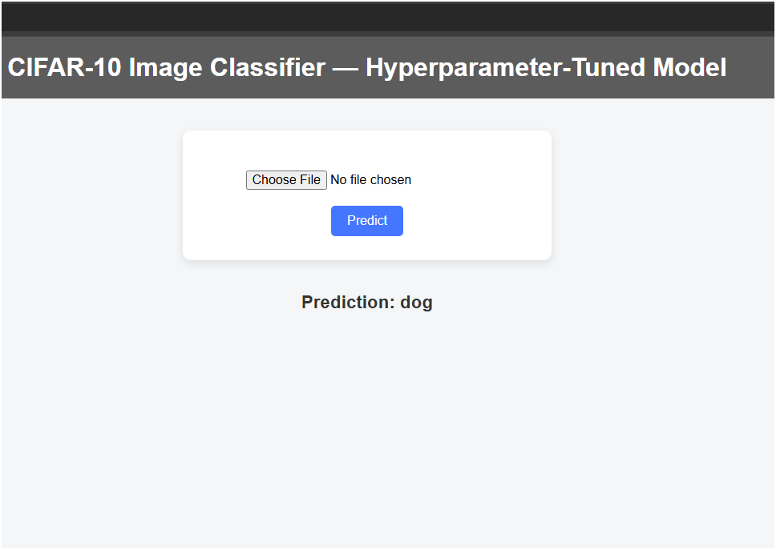

# CIFAR-10 CNN Classifier – Training & Deployment

This project demonstrates both machine learning experimentation and deployment of a trained CNN model for image classification using the CIFAR-10 dataset.

It includes:
- CNN CIFAR-10 experiments (Jupyter Notebook) – Training and comparing different CNN architectures.
- Flask Web App – Serving the trained model with a basic web interface, only to showcase the model accuracy.
- Docker Containerization – Deployable as a Docker image for portability.


## Model Training

The CNN CIFAR-10 experiments notebook contains:

1. Baseline CNN
2. CNN with BatchNorm + Dropout
3. Two convolutional Deep CNN (No Data Augmentation)
4. Two convolutional Deep CNN (With Data Augmentation)
5. CNN + Hyperparameter tuning with Hyperband
6. Final Optimised Model


### The Model used in this deployment
CIFAR-10 IMAGE CLASSIFIER — Hyperparameter-Tuned Model

#### Training accuray <font color="green">(94%)</font>
#### Validation accuracy <font color="green">(87.8%)</font>
#### Test accuracy <font color="green">(87.2%)</font>

<br>Using a pre-trained Model with Flask web app to classify images of CIFAR-10 categories.


### Requirements
Python 3.10+
<br>Flask 2.3.3
<br>Pillow
<br>Numpy
<br>TensorFlow

### A Simple Webpage
Using a minimalistic Docker configuration with Flask serving the hyperparameter-tuned CNN model with an easy frontend for file upload and prediction.



## Docker Setup

Make sure you have Docker installed:
### Build the Docker Image
Go into the backend folder of the project: ".../Docker-Flask Deployment"
```
docker build -t cifar10-hyper-app .
```

Run docker container
```
docker run -d -p 5000:5000 cifar10-hyper-app
```

Run in browser
http://127.0.0.1:5000


## Running without Docker (Locally)

### Create and activate Virtual Environment
open "app" folder and create Venv
```
python -m venv venv
```

activate venv
```
. venv/Scripts/activate
```

install dependencies
```
pip install -r requirements.txt
```

run the flask app
```
python main.py
```

Run in browser
http://127.0.0.1:5000
