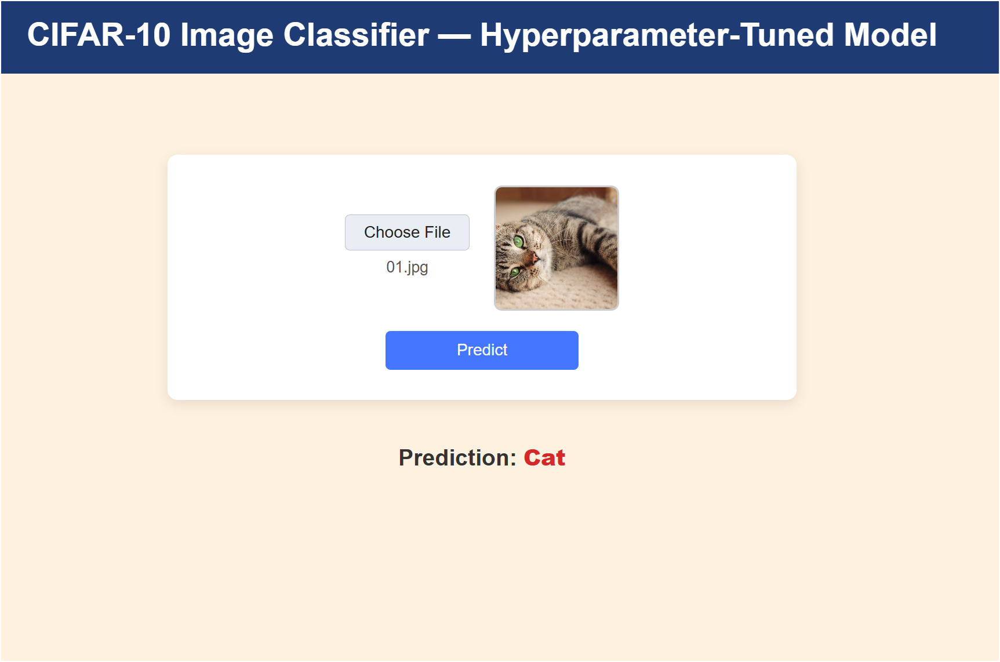

# CIFAR-10 CNN Classifier - Training & Deployment

This project focuses on training, evaluating, and deploying a CNN-based image classifier for the CIFAR-10 dataset.

It includes:
- CNN CIFAR-10 experiments (Jupyter Notebook) - Building and comparing multiple CNN configurations in TensorFlow/Keras
- Flask Web App - Serving the best saved model through a simple image upload interface
- Docker Containerization - Packaging the Flask app for portable deployment

## Model Training

The `CNN CIFAR-10 experiments.ipynb` notebook contains:

1. Baseline CNN
2. CNN with Batch Normalization + Dropout
3. Deeper CNN without data augmentation
4. Deeper CNN with data augmentation
5. Hyperparameter tuning with Keras Tuner Hyperband
6. Final model rebuilt from the best hyperparameters

The notebook also includes model evaluation, prediction visualizations, and single-image inference examples.

### Model used in deployment

CIFAR-10 Image Classifier - Hyperparameter-Tuned Model

#### Training accuracy <font color="green">(94%)</font>
#### Validation accuracy <font color="green">(87.8%)</font>
#### Test accuracy <font color="green">(87.2%)</font>

<br>Uses the trained hyperparameter-tuned model in a Flask web app to classify uploaded images into CIFAR-10 categories.

### Requirements

Python 3.10+  
Flask 2.3.3  
Pillow  
NumPy  
TensorFlow

### Web App

Uses a minimal Flask + Docker setup to serve the trained model with a simple file upload and prediction page.



## Docker Setup

Make sure you have Docker installed.

### Build the Docker Image

Go into the deployment folder:

```bash
cd "Docker-Flask Deployment"
docker build -t cifar10-hyper-app .
```

### Run the Docker Container

```bash
docker run -d -p 5000:5000 cifar10-hyper-app
```

Open in browser:

`http://127.0.0.1:5000`

## Run Locally

### Create and activate a virtual environment

Open the `Docker-Flask Deployment/app` folder and create a virtual environment:

```bash
python -m venv venv
```

Activate it:

```bash
venv\Scripts\activate
```

Install dependencies:

```bash
pip install -r requirements.txt
```

Run the Flask app:

```bash
python main.py
```

Open in browser:

`http://127.0.0.1:5000`
